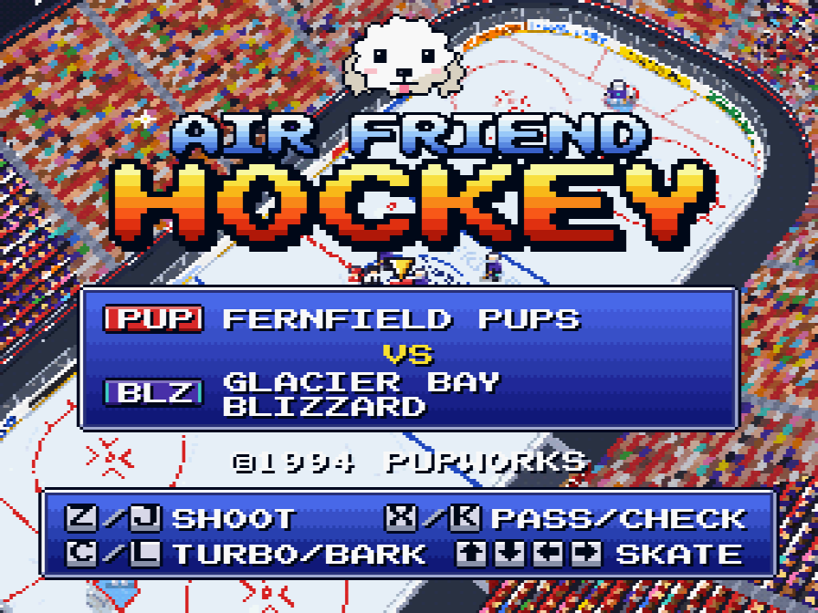
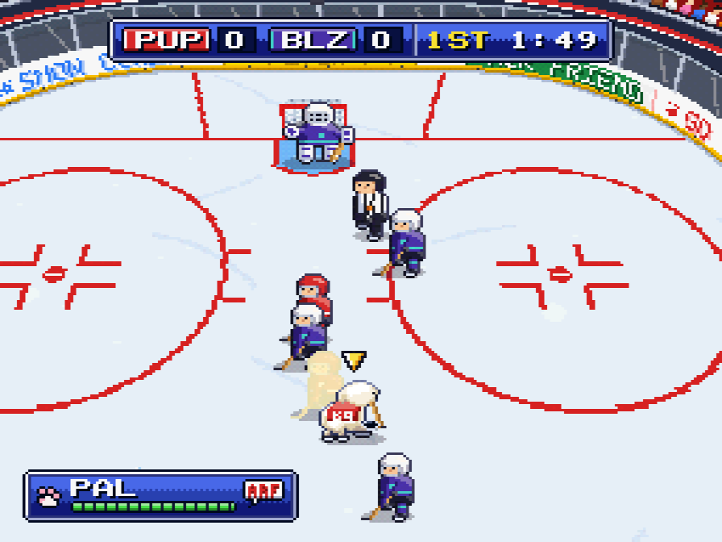
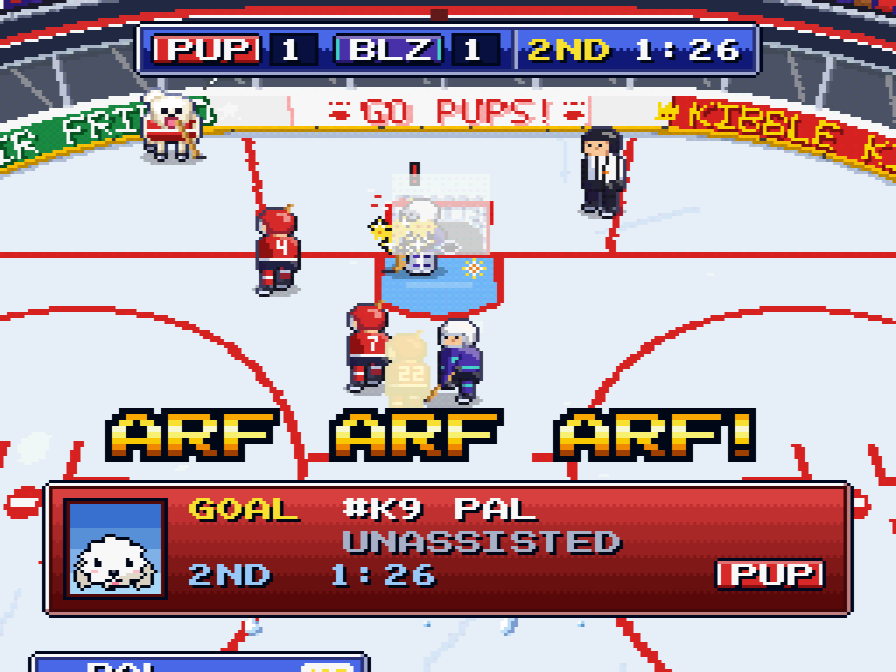
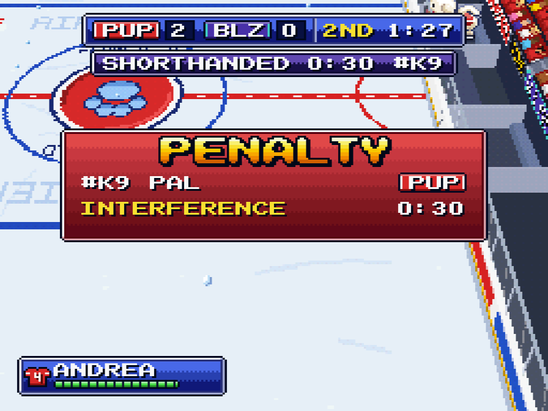
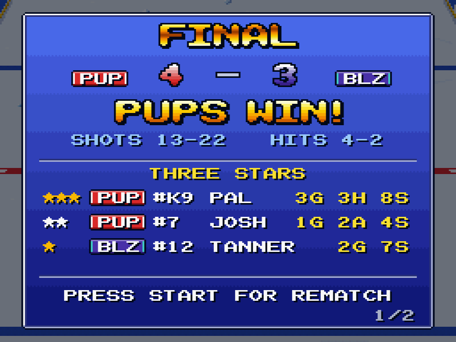

# AIR FRIEND HOCKEY

A fake 1994 Super Nintendo ice hockey cartridge, in TypeScript + three.js.
You play **PAL**, a bichon frise who plays center for the FERNFIELD PUPS (a team
of kids) against the GLACIER BAY BLIZZARD. It's Air Bud on ice: 5 v 5, four skaters plus a goalie per team.

There are no menus. The page boots straight into the intro and the opening faceoff.
Every graphic and every sound is generated in code, so the game loads no asset files.

<p align="center">
  
</p>

<table>
  <tr>
    <td align="center"><br><sub>PAL carries the puck up ice</sub></td>
    <td align="center"><br><sub>PAL scores</sub></td>
  </tr>
  <tr>
    <td align="center"><br><sub>Even the dog gets penalties</sub></td>
    <td align="center"><br><sub>Final score and three stars</sub></td>
  </tr>
</table>

## Run

```sh
npm install
npm run dev        # http://localhost:5199
```

Production build (typechecks `src/` only, then bundles into `dist/`):

```sh
npm run build
npm run preview    # serve dist/
```

## Controls

| Key | With the puck | Without the puck |
|---|---|---|
| Arrows / WASD | skate (up = attack, every period) | skate |
| Z / J (SHOOT) | hold = wind up, release = shoot; tap = quick wrist shot; ←/→ held picks the corner, the charge sets the height | poke check; if a teammate has the puck: call for a shot (or for a pass, when he's out of range); held while a pass comes = one-timer |
| X / K (PASS) | pass toward the held direction (or to the best open teammate) | body check; if a teammate has the puck: call for a pass |
| C / L (TURBO) | hold = sprint (stamina meter); a press next to a puck carrier, or a quick tap, = **BARK** (startles, can make the carrier fumble) | same |
| Enter / P / Esc (START) | pause / resume, skip intermission, rematch on the final screen | |
| M | mute | |
| V | CRT scanlines | |
| F / double-click | fullscreen on/off (Esc also leaves it) | |

Faceoffs: after the ref drops the puck, the first center to press SHOOT or PASS wins it.
Pressing early is a false start. Body checks can draw penalties. PAL can be sent to the
box too, and control then switches to a teammate until PAL is back.

Sound starts on the first key press (browser autoplay policy).

The two layouts can be mixed freely: a button stays held while any of its keys is down, so
holding → and tapping D never stops PAL, and pressing J while Z is held is not a second shot.
Ctrl, Cmd/Meta and Alt chords belong to the browser (Ctrl+L, Ctrl+S, Cmd+M...): the game
ignores them and does not block them. Shift changes nothing.

Leaving the game pauses it: hiding the tab or alt-tabbing away (window blur) during a faceoff,
live play, a whistle, a goal, a penalty or the period-end horn sets PAUSE, and it stays paused
when you come back until you press START. Intermission and the final screen run on. Sound is
suspended while the tab is hidden.

URL parameters: `?mute=1`, `?crt=1`. Test-only switches and the test API are described in
[TESTING_TOOLS.md](TESTING_TOOLS.md#test-mode).

## Layout

```
src/main.ts        boot, fixed 60 Hz loop, test API (window.__airfriend; dev server or ?test=1)
src/core/          keyboard -> pad; fixed-step clock + render interpolation (loop.ts);
                   device-pixel-exact sharp-bilinear presentation + CRT scanlines (display.ts)
src/sim/           rules, physics, penalties, faceoffs, goalies, referee (no DOM, runs in node)
src/ai/            team tactics, skater and goalie AI (no DOM)
src/render/        three.js: arena, camera, 256x224 SNES framebuffer + 15-bit post, sprites, effects
src/render/art/    all pixel art, authored as palette-char grids and packed into atlases
src/ui/            HUD: 8x8 bitmap font, windows, banners, intermission/final/pause screens
src/audio/         WebAudio synth: SFX, chiptune music, crowd
DESIGN.md          the full spec
TESTING_TOOLS.md   test mode, test/harness commands, typecheck configs
```

## Testing

See [TESTING_TOOLS.md](TESTING_TOOLS.md): test mode, every test and harness command (none
of them open a visible window), the typecheck configs, and the runtime hooks the tests use.
Quick check: `make test`.
